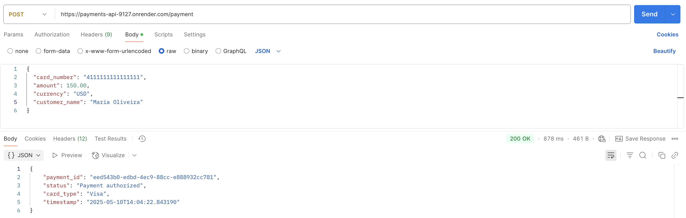
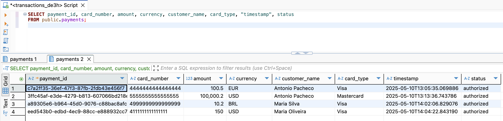

# Mock Payments API

## Project Overview
A RESTful API for simulating payment flows, including authorization, refund, transaction status query, and settlement file generation.

This project replicates key functionalities found in real-world payment acquirer and processor systems. Built with FastAPI, SQLAlchemy, Docker, and deployed on Render, it demonstrates backend development, API design, and deployment practices.

## Tech Stack

- Python
- FastAPI
- SQLAlchemy
- SQLite (local) / PostgreSQL (production)
- Uvicorn
- Docker
- Render (deployment)

The development followed three main stages:

### 1. API Design and Implementation

- Developed RESTful endpoints using **FastAPI**:
  - `POST /payment` to create a new payment
  - `GET /status/{payment_id}` to check payment status
  - `POST /refund/{payment_id}` to request a refund
- Defined request/response models with **Pydantic** for data validation
- Implemented simulated logic for authorization and refund flows

#### Features

- Create a payment (`POST /payment`)
- Refund a payment (`POST /refund/{payment_id}`)
- Retrieve payment status (`GET /status/{payment_id}`)

  


### 2. PostgreSQL Integration and External Access

- Configured **PostgreSQL as the production database** to store payment records
- Set up **SQLAlchemy ORM** to manage database interactions
- Created a **Payment** model and database schema using SQLAlchemy’s declarative base
- Developed an **initialization script** to generate tables in the PostgreSQL instance
- Verified database schema and records by connecting externally with **DBeaver**
- Ensured that the deployed API writes and reads from the live PostgreSQL database hosted on Render

  

### 3. Containerization and Deployment

- Wrote a **Dockerfile** to containerize the FastAPI application
- Built and ran the application locally using Docker
- Deployed the Dockerized application to **Render**, exposing the API publicly
- Verified deployment and tested the API in a live environment
- Connected to the production database externally to validate records


## Running Locally

To build and run the application locally with Docker:

```bash
docker build -t payments-api .
docker run -d --restart always -p 8000:8000 payment-api
```

Access the API documentation at: http://localhost:8000/docs

## Public API
This API is deployed using Docker on Render.

Access the live API here:
https://payments-api-9127.onrender.com/docs

## Example Payload

```bash
{
  "card_number": "4111111111111111",
  "amount": 150.00,
  "currency": "USD",
  "customer_name": "Maria Oliveira"
}
```
